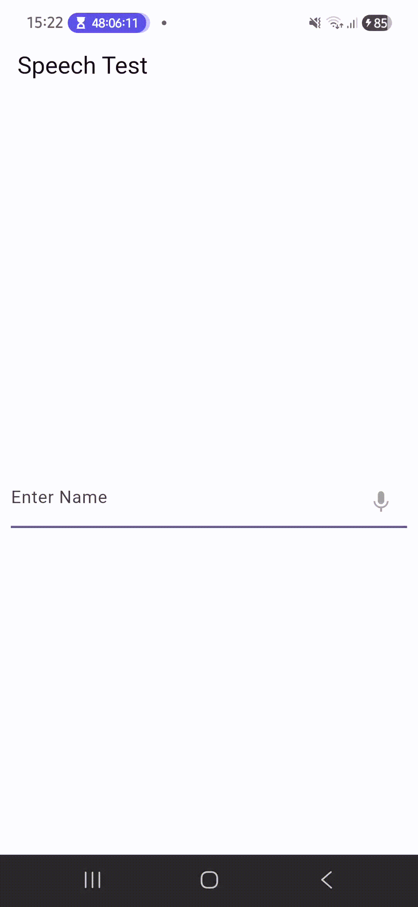
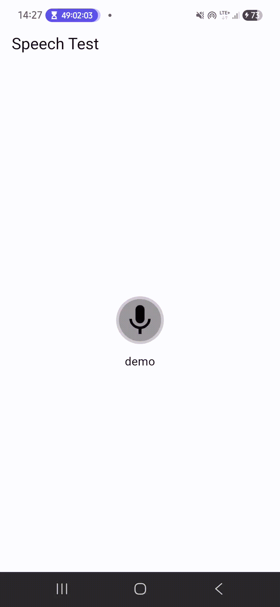

# Flutter Speak To Type

A simple and customizable Flutter widget that converts speech to text and automatically fills your `TextField` controller.

## Features

✅ Speech-to-Text Support

✅ Auto Fill TextField

✅ Custom Mic Icon

✅ Custom Glow Animation Color

✅ Press & Hold Recording

✅ Real-Time Text Updates

✅ Easy Integration

---

## Installation

Add the dependency to your `pubspec.yaml`:

```yaml
dependencies:
  library_flutter_speaktotext:
    git:
      url: https://github.com/Excelsior-Technologies-Community/library_flutter_speaktotext.git
```

Then run:

```bash
flutter pub get
```

---

## Android Setup

Add microphone permission inside:

`android/app/src/main/AndroidManifest.xml`

```xml
<uses-permission android:name="android.permission.RECORD_AUDIO"/>
```

If targeting Android SDK 30 or higher, also add:

```xml
<queries>
    <intent>
        <action android:name="android.speech.RecognitionService" />
    </intent>
</queries>
```

Example:

```xml
<manifest xmlns:android="http://schemas.android.com/apk/res/android">

    <uses-permission android:name="android.permission.RECORD_AUDIO"/>

    <queries>
        <intent>
            <action android:name="android.speech.RecognitionService" />
        </intent>
    </queries>

    <application>
        ...
    </application>

</manifest>
```

---

## Usage

Import the package:

```dart
import 'package:library_flutter_speaktotext/speaktotext/speaktotextconveter.dart';
```

Create a controller:

```dart
TextEditingController txtCtrl = TextEditingController();
```

Use inside your TextField:

```dart
TextField(
  controller: txtCtrl,
  decoration: InputDecoration(
    hintText: "Speak or type",
    suffixIcon: Speaktotextconveter(
      icon: Icons.mic,
      animateColor: Colors.black,
      onResult: (text) {
        txtCtrl.text = text;

        txtCtrl.selection = TextSelection.fromPosition(
          TextPosition(offset: txtCtrl.text.length),
        );
      },
    ),
  ),
)
```

---

## Complete Example

```dart
import 'package:flutter/material.dart';
import 'package:library_flutter_speaktotext/speaktotext/speaktotextconveter.dart';

class SpeechTest extends StatefulWidget {
  const SpeechTest({super.key});

  @override
  State<SpeechTest> createState() => _SpeechTestState();
}

class _SpeechTestState extends State<SpeechTest> {
  final TextEditingController txtCtrl = TextEditingController();

  @override
  Widget build(BuildContext context) {
    return Scaffold(
      appBar: AppBar(
        title: const Text("Speak To Type Example"),
      ),
      body: Padding(
        padding: const EdgeInsets.all(20),
        child: TextField(
          controller: txtCtrl,
          decoration: InputDecoration(
            hintText: "Speak something...",
            border: const OutlineInputBorder(),
            suffixIcon: Speaktotextconveter(
              icon: Icons.mic,
              animateColor: Colors.red,
              onResult: (text) {
                txtCtrl.text = text;
              },
            ),
          ),
        ),
      ),
    );
  }
}
```

---

## Customization

```dart
Speaktotextconveter(
  icon: Icons.mic,
  animate: true,
  animateColor: Colors.blue,
  onResult: (text) {
    print(text);
  },
)
```

### Properties

| Property | Type | Default | Description |
|-----------|------|----------|-------------|
| icon | IconData | Required | Microphone icon |
| animate | bool | true | Enable glow animation |
| animateColor | Color | Colors.red | Glow color |
| onResult | Function(String)? | null | Returns recognized text |

---

## Dependencies

- speech_to_text
- avatar_glow

## demo



## License
## MIT License

Copyright (c) 2026 Excelsior Technologies

Permission is hereby granted, free of charge, to any person obtaining a copy
of this software and associated documentation files (the "Software"), to deal
in the Software without restriction, including without limitation the rights
to use, copy, modify, merge, publish, distribute, sublicense, and/or sell
copies of the Software, and to permit persons to whom the Software is
furnished to do so, subject to the following conditions:

The above copyright notice and this permission notice shall be included in all
copies or substantial portions of the Software.

THE SOFTWARE IS PROVIDED "AS IS", WITHOUT WARRANTY OF ANY KIND, EXPRESS OR
IMPLIED, INCLUDING BUT NOT LIMITED TO THE WARRANTIES OF MERCHANTABILITY,
FITNESS FOR A PARTICULAR PURPOSE AND NONINFRINGEMENT. IN NO EVENT SHALL THE
AUTHORS OR COPYRIGHT HOLDERS BE LIABLE FOR ANY CLAIM, DAMAGES OR OTHER
LIABILITY, WHETHER IN AN ACTION OF CONTRACT, TORT OR OTHERWISE, ARISING FROM,
OUT OF OR IN CONNECTION WITH THE SOFTWARE OR THE USE OR OTHER DEALINGS IN THE
SOFTWARE.

---